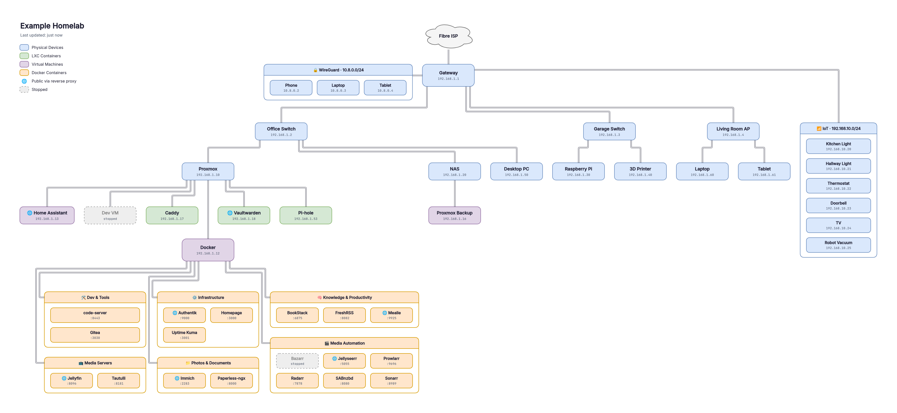
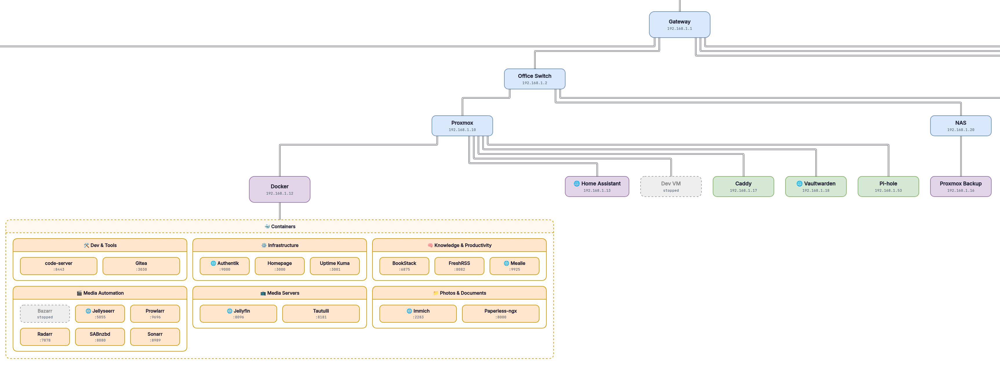

# homelab-map

<picture>
  <source media="(prefers-color-scheme: dark)" srcset="docs/demo-dark.png">
  
</picture>

<sub>An example homelab, drawn by `homelab-map demo`. Click the image for full size.</sub>

<picture>
  <source media="(prefers-color-scheme: dark)" srcset="docs/demo-dark-closeup.png">
  
</picture>

<sub>Close-up: a Proxmox host and its guests, and a Docker host's containers grouped into lanes. Stopped things are greyed out; 🌐 marks public services.</sub>

A network map of your homelab that draws and updates itself: the gateway, switches and access points,
the devices on them, the VMs and LXCs on your hypervisors, and the Docker containers on each host,
with every line placed so that **no two lines ever touch or cross**.

It checks every minute. When something really changes (a container stops, a device appears, a
service goes public), it redraws the map and publishes it: as files, on a built-in web page, and/or
as an editable draw.io drawing on a BookStack page. Otherwise it does nothing.

- **Found automatically**: the physical layout from UniFi, VMs and LXCs from Proxmox (or guessed from
  UniFi alone), containers from Docker, and which services are public from your Caddyfile.
- **Everything else is config**: devices no source knows about, renames, hiding, colours.
- **Your secrets stay yours**: they live in `.env` on your machine. Every account it uses is
  read-only.

## What it looks like

Top to bottom it follows the network: Internet → gateway → switches and access points → hosts →
guests → containers. Colour shows what something is (physical, LXC, VM, container), stopped things
are greyed out with a dashed border, and 🌐 marks services reachable from the internet. Other
networks (IoT, guest) and VPN clients are drawn as lanes off the gateway; a Docker host's containers
sit in one box, one lane per group (Media Automation, Infrastructure, ...).

## Status

This is an early release (v0.1). The core has been run for real against one homelab (UniFi, Docker,
Caddy over SSH, BookStack), and the layout is tested against thousands of generated homelabs. These
parts are written but **not yet tested on a real setup**, so reports are very welcome:

- the Proxmox source
- sending alerts to Gotify, ntfy or a webhook
- the self-hosted UniFi Network application (UniFi OS consoles are tested)
- more than one Docker host

If something is drawn in the wrong place, or a source doesn't work, please
[open an issue](../../issues) with the output of `check` (remove anything private first).

## Quick start

You need Docker with Compose, on a machine that can reach your gateway (and Proxmox, if you use it).

```bash
git clone https://github.com/LionCityGaming/homelab-map.git && cd homelab-map
cp config.example.yaml config.yaml
cp .env.example .env
mkdir data
```

To see what it draws before configuring anything:

```bash
docker compose run --rm homelab-map demo
```

That writes an example map (the one above) to `data/output/demo-light.png` and `demo-dark.png`.

1. Fill in `config.yaml` (it's commented) and put the passwords and tokens it refers to in `.env`.
2. See what it finds, before anything is published:

   ```bash
   docker compose run --rm homelab-map check
   ```

   This prints everything as a tree, any warnings, and a ready-to-paste `containers.groups` block
   for containers it grouped by best guess.
3. Start it:

   ```bash
   docker compose up -d
   ```

   Open `http://<this machine>:8080` for the map. Services with a URL are clickable.

## Setting up each source

All of them are optional; use what you have. Each is **read-only**.

### UniFi (the network tree)

Create a local admin just for this: *Settings → Admins & Users → Create New*, role **View Only**,
restricted to local access. Don't use your own account. Then in `config.yaml`:

```yaml
sources:
  unifi:
    url: https://192.168.1.1
    username: ${UNIFI_USER}
    password: ${UNIFI_PASS}
```

Works with UniFi OS consoles (UCG, UDM, UDR, UXG, Cloud Key) and the self-hosted Network app.
Clients with a fixed IP are drawn (set `clients: all` for everything). VMs are recognised by their
MAC address and put under the host whose switch port they share, even without Proxmox.

### Proxmox (VMs and LXCs)

*Datacenter → Permissions → API Tokens → Add*, then *Datacenter → Permissions → Add → API Token
Permission* with path `/` and role **PVEAuditor**. Put the token id (`user@realm!name`) and secret
in `.env`. Guests are matched to UniFi's devices by MAC, so they keep the names you gave them there.

### Docker (containers)

The compose file includes a read-only socket proxy for the machine it runs on. For other Docker
hosts, run [`tecnativa/docker-socket-proxy`](https://github.com/Tecnativa/docker-socket-proxy)
there with `CONTAINERS=1 IMAGES=1` and point at it (keep that port on your LAN only).

Which containers are drawn: ones that publish a port, plus one box for a stack with no web UI at all.
Databases, caches, workers and sidecar proxies are left out. Containers are grouped by
`containers.groups`, a `homelab-map.group` label, or a best guess from the image's description
(from its labels, GitHub and Docker Hub). Labels you can put on containers:

| Label | Does |
|---|---|
| `homelab-map.group` | the lane it goes in |
| `homelab-map.name` | its label on the map |
| `homelab-map.port` | the port to show (host networking) |
| `homelab-map.hide=true` | leave it off |

### Caddy (what's public)

Mount your Caddyfile read-only (see `docker-compose.yml`), or read it over SSH with a key that can
do nothing else. On the Caddy host, in `~/.ssh/authorized_keys`:

```
command="cat /etc/caddy/Caddyfile",restrict,from="<homelab-map host IP>" ssh-ed25519 AAAA...
```

A site is public if it imports one of `public_snippets` (default `public`) or its address matches
one of `public_hosts`. Its target is matched to a container (host IP and published port, container
name, or the subdomain for host-networked containers) or to a device by IP.

## Where the map goes

| Output | What you get |
|---|---|
| **files** | `data/output/`: `map.png`, `map.pdf`, `map.drawio` (plus light and dark versions) |
| **web** | the viewer on port 8080, which refreshes itself when the map changes |
| **bookstack** | an editable draw.io drawing on a page: give it the page id, and the drawing is added the first time and replaced in place after that |

The PNG carries the diagram inside it, so opening it in draw.io gets you the editable version.

For BookStack, create an API token (*your profile → API Tokens*) for a user whose role has
**Access System API** and can edit the page.

## Alerts

Gotify, ntfy or any webhook. You get one alert when something needs a look (a stopped container, a
new container grouped by guess, a source that's down, a failed publish), not one every minute.

## Colours

```yaml
palette: pastel          # default | vivid | pastel | mono
theme: light             # which version is rendered and published
colors:                  # your own, on top: one colour, or [light, dark]
  container: {fill: ["#FFE6CC", "#7A4A1E"], border: "#D79B00"}
  lines: ["#333333", "#CBD5E0"]
```

## Security

- Secrets only in `.env`, which is git-ignored. `config.yaml` refers to them as `${NAME}`.
- Every account is read-only: a UniFi View Only admin, a Proxmox PVEAuditor token, Docker through a
  socket proxy that only allows reading containers and images, and optionally an SSH key that can
  only print the Caddyfile. The BookStack token is the one thing that writes, and only to the page
  you give it.
- The web viewer has no login: keep port 8080 on your LAN, or put it behind your reverse proxy and SSO.
- The app runs as a non-root user. Nothing else is exposed: the renderer and socket proxy have no
  published ports.

## Troubleshooting

- **`check` says a source is unavailable**: the URL or credentials are wrong, or it can't reach it.
  Once a source has worked, a later outage uses the last good copy (with a warning) rather than
  blanking the map.
- **Something is under the wrong parent**: `overrides.parent` in `config.yaml`.
- **Can't write to /data**: Docker created `./data` as root. `sudo chown -R 1000:1000 data`.
- **The map didn't update**: it only redraws when something changed. `docker compose run --rm
  homelab-map once --force` redraws and republishes now.

## How the layout works

Every parent's subtree gets its own vertical strip, so lines from different parents can't meet.
Within one parent, a child straight below gets a straight line; children to each side leave the
parent at their own point and turn at their own level, outermost first, so the lines nest instead
of crossing. After every layout, every pair of line segments and every line against every box is
checked; a layout that fails is never published (you get an alert instead). The test suite runs this
against thousands of randomly generated homelabs.

## Development

```bash
pip install -r requirements.txt
python -m unittest discover -s tests -t .
python -m homelab_map check --config config.yaml --data ./data
python -m homelab_map demo --data ./data     # PNGs need the renderer: set render.export_url
```

## License

MIT
